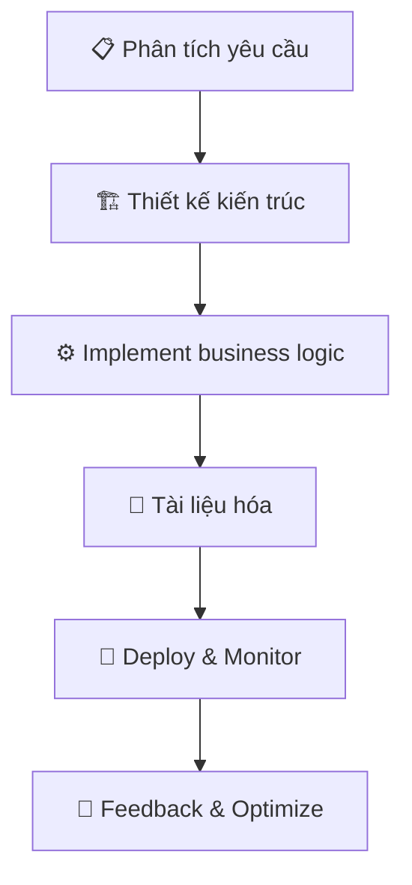

<div align="center">

# 👋 Hi, I'm Ryan ! 
### � Backend & DevOps Engineer | 💡 Problem Solver | ⚡ Performance En---

<div align="center">

## 🛠️ **Tech Stack & Tools**


</div>

<details>
<summary>📋 <b>Detailed Tech Stack</b></summary>

### 🖥️ **Backend**
```yaml
Languages & Frameworks:
  - PHP: Laravel (Expert)
  - Node.js: Express.js, NestJS (Expert)
  - TypeScript: Production-ready (Expert)
  - Python: Backend development (Intermediate)
```

### 🎨 **Frontend**
```yaml
Technologies:
  - HTML/CSS: Semantic & responsive
  - Tailwind CSS: Utility-first styling
  - Next.js: React framework
```

### 🔌 **API Development**
```yaml
Expertise:
  - RESTful APIs: Authentication, versioning, pagination
  - GraphQL: Schema design, resolvers, optimization
  - Features: Caching, rate limiting, role-based access
```

### 🗄️ **Databases**
```yaml
Relational:
  - PostgreSQL: Advanced queries, optimization
  - MySQL: Production deployment
NoSQL:
  - MongoDB: Document-based solutions
```

### ⚙️ **DevOps & Infrastructure**
```yaml
Containerization:
  - Docker: Multi-stage builds
  - Docker Compose: Local development
CI/CD:
  - GitHub Actions: Automated workflows
  - GitLab CI: Pipeline optimization
Web Servers:
  - Nginx: Reverse proxy, load balancing
  - PM2: Process management
```

### ☁️ **AWS Cloud Services**
```yaml
Storage & Database:
  - S3: Static assets, backups
  - RDS: Managed PostgreSQL/MySQL
  - CloudFront: CDN distribution

Compute & API:
  - Lambda: Serverless functions
  - API Gateway: API management
  - ECS/ECR: Container orchestration

Monitoring & Security:
  - CloudWatch: Logging & monitoring
  - IAM: Access management
  - Secrets Manager: Secret rotation
  - SES/SQS/SNS: Messaging services
```

### 💳 **Payment Integrations**
```yaml
International:
  - Stripe: Complete payment flows
  - PayPal: Express checkout
  - Adyen/Braintree: Enterprise solutions

Vietnam:
  - VNPAY: Local payment gateway
  - MoMo: E-wallet integration
  - ZaloPay: Digital payments
```

### 🔧 **Additional Tools**
```yaml
Media & Communication:
  - Cloudinary: Image/video optimization
  - TalkJS: Real-time chat
Analytics & Monitoring:
  - Google Analytics: User tracking
  - Google Tag Manager: Event management
Security:
  - 2FA: Multi-factor authentication
  - JWT: Token-based auth
```

</details>

<p>
  
  
  
  
</p>

</div>

---

<div align="center">

## 🎯 **Đưa sản phẩm lên production NHANH • ỔN ĐỊNH • DỄ MỞ RỘNG**

*Backend & DevOps — thiết kế API (REST/GraphQL), tự động hóa triển khai (Docker + CI/CD) và tích hợp dịch vụ thanh toán & cloud*

</div>

---

<table>
<tr>
<td width="50%">

## 🧭 **Mục tiêu & Triết lý**

```yaml
philosophy:
  simplicity: "Đơn giản mà vững"
  reliability: "Độ tin cậy là ưu tiên #1"
  automation: "Tự động hóa mọi quy trình"
  learning: "Học hỏi & chia sẻ liên tục"
```

- 🏗️ Xây hệ thống **đơn giản mà vững**, dễ bảo trì
- 📊 Log/monitor rõ ràng, rollback an toàn
- ⚡ Ưu tiên **tốc độ ra tính năng** qua automation
- 🤝 Chia sẻ để cả team cùng phát triển

</td>
<td width="50%">

## 💼 **Tôi làm gì?**



- **Backend:** Từ ý tưởng → Production
- **DevOps:** Docker + CI/CD + Cloud
- **API:** REST & GraphQL design
- **Integration:** Payments + AWS services

</td>
</tr>
</table>

---

<div align="center">

## 🧩 **Năng lực cốt lõi**

</div>

<table>
<tr>
<td width="33%">

### 🔗 **API Design**


- REST chuẩn hoá (resource, status codes)
- GraphQL schema-first/code-first
- Versioning, pagination, caching
- Rate limiting & authentication

</td>
<td width="33%">

### ⚡ **Performance**


- Database query profiling
- Strategic caching
- Payload optimization
- TTFB/latency monitoring
- Bottleneck analysis

</td>
<td width="33%">

### 🏗️ **Code Quality**


- Unit/Integration testing
- Code review culture
- SOLID principles
- 12-Factor methodology
- Clean architecture

</td>
</tr>
</table>

---

## 🛠️ Tech stack
**Backend:** PHP (**Laravel**), **Node.js** (**Express.js**, **NestJS**, **TypeScript**), **Python (BE)**  
**Frontend:** HTML/CSS, **Tailwind CSS**, **SCSS**, **Bootstrap 5**, **Next.js**  
**API:** **RESTful & GraphQL** (auth/role, versioning, pagination, caching, rate limit)  
**Databases:** **PostgreSQL**, **MySQL**, **MongoDB**  
**DevOps:** **Docker/Compose**, **CI/CD** (GitHub/GitLab), **Nginx**, **PM2/systemd**  
**Cloud (AWS):** **S3**, **RDS** (PostgreSQL/MySQL), **CloudFront**, **API Gateway**, **Lambda**, **ECS/ECR**, **CloudWatch**, **IAM**, **Secrets Manager/Parameter Store**, **SES/SQS/SNS**  
**Payments & Integrations:** **Stripe**, **PayPal**, **VNPAY**, **MoMo**, **ZaloPay**, **Adyen/Braintree** (tuỳ thị trường); **Cloudinary**, **TalkJS**, **Google Analytics/Tag**, **2FA**  

> *Chỉ liệt kê những gì bạn thực sự từng sử dụng ở mức triển khai/vận hành.*

---

<div align="center">

## 🔐 **Security & Compliance**


</div>

<table>
<tr>
<td width="50%">

### 🛡️ **Security Measures**
- 🔒 **SSL/TLS** đúng chuẩn + HSTS headers
- 🔐 **HMAC/Signature** verification cho webhooks
- 🎯 **Least privilege** IAM policies
- 📊 **Audit logs** & access monitoring
- 🔑 **Environment secrets** management

</td>
<td width="50%">

### ⚡ **Reliability Features**
- 🔄 **Idempotency** cho operations nhạy cảm
- 🔁 **Retry/Backoff** mechanisms với tracking
- 📈 **Health checks** & monitoring
- 🚨 **Alert systems** cho incidents
- ⏪ **Rollback procedures** tested

</td>
</tr>
</table>

---

<div align="center">

## 🔄 **Workflow & Collaboration**

</div>

<table>
<tr>
<td width="25%">

### 🌿 **Git Workflow**
```bash
# Clean commits
git commit -m "feat: add payment API"

# Proper branching
feature/payment-integration
hotfix/security-patch
release/v2.1.0
```

</td>
<td width="25%">

### 🚀 **CI/CD Pipeline**
```yaml
steps:
  - lint: ✅ Code quality
  - test: 🧪 Unit & Integration  
  - build: 🐳 Docker image
  - deploy: 🚀 Zero-downtime
  - monitor: 📊 Health check
```

</td>
<td width="25%">

### 📊 **Monitoring**
```yaml
observability:
  logs: 📝 Centralized logging
  metrics: 📈 Performance KPIs
  alerts: 🚨 Real-time notifications
  health: ❤️ Service status
```

</td>
<td width="25%">

### 🤝 **Team Collaboration**
```yaml
methodology:
  framework: Agile (lightweight)
  communication: Transparent
  feedback: Fast iteration
  documentation: Clear & updated
```

</td>
</tr>
</table>

<div align="center">

### 🎯 **Development Principles**


</div>

---

<div align="center">

## 📚 **Continuous Learning Journey**


</div>

<table>
<tr>
<td width="33%">

### 🎯 **Current Focus**
- 🏗️ **Large-scale API** design patterns
- 📊 **Observability** (metrics/tracing)
- 💰 **Cost optimization** on cloud platforms
- 📈 **Performance tuning** strategies

</td>
<td width="33%">

### 🚀 **Next Goals**
- 🔬 **Microservices** architecture
- 🤖 **AI/ML** integration in backends
- 🌍 **Multi-region** deployments
- 📱 **Mobile-first** API design

</td>
<td width="33%">

### 🎓 **Knowledge Sharing**
- 📖 Internal **guidelines** & **best practices**
- 🏗️ **Boilerplate** projects
- ✅ **Quality checklists**
- 🎤 **Tech talks** & mentoring

</td>
</tr>
</table>

---

<div align="center">

## 📬 **Let's Connect & Build Something Amazing!**

<table>
<tr>
<td align="center">

### 📧 **Email**
<a href="mailto:dattruong19122003@mail.com">
  
</a>

</td>
<td align="center">

### 💼 **LinkedIn**
<a href="https://www.linkedin.com/in/tr%C6%B0%C6%A1ng-qu%E1%BB%91c-%C4%91%E1%BA%A1t-8035a4249/">
  
</a>

</td>
<td align="center">

### 🌍 **Timezone**


</td>
</tr>
</table>

### 🚀 **Open for Opportunities**
```yaml
availability:
  - Full-time Backend/DevOps positions
  - Part-time consulting projects  
  - Remote collaboration (global teams)
  - Technical mentoring & code reviews
```


</div>

---

<div align="center">

## 🏆 **Achievement Badges**


<details>
<summary>📊 <b>GitHub Stats</b></summary>


</details>

---

<sub>💡 <i>Interested in my work? Let's discuss how we can build scalable, secure, and performant solutions together!</i></sub>

</div>
